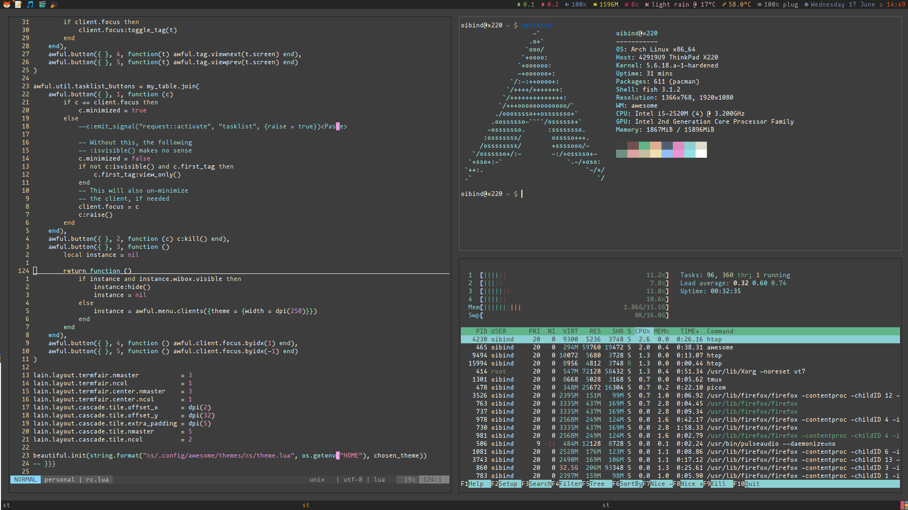

### Install

git clone oibind/dotfiles && cd dotfiles && ./install

### Packages I use

| package name | what it do |
| - | - |
awesome | tiling window manger based on dwm
nvim | text editor (new hipster version of vim)
fish | friendly interactive shell
termite | terminal emulator
yay | AUR support
sxiv | lightweight image viewer
ranger | terminal based file manager
ueberzug | displays images in terminal
fzf | command-line fuzzy finder
firefox | web browser
wicd | wi-fi interface
htop-vim | system monitor with vi keybindings
xtrlock | screen locker from the 90s
snapper | automatic btrfs snapshots
spotify | i can haz music?

### The all important obligatory screenshot

